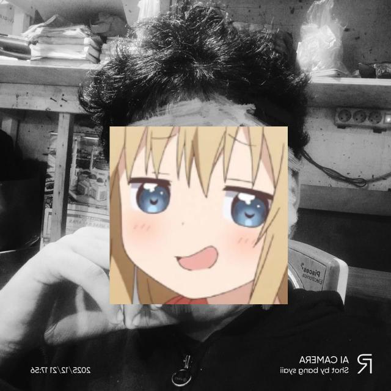

   
  
  
  <h1 align="center">Bang_syaii</h1>
  <h3 align="center">Full Stack Developer | System Architect</h3>
  
  

    <b>Scalable Web Systems Engineered for Performance.</b>
  

  

    System Architect focused on building the backbone of modern web applications. From designing database schemas to optimizing API response times, I ensure every system I build is scalable and secure.
  

  <!-- Social Links -->
  

    
    
    
    
    
  

---

### 👨‍💻 About Me

**Hello, World!** 👋

I'm a passionate Full Stack Developer based in Indonesia. My journey in tech started with a curiosity for how things work, which quickly evolved into an obsession with building them.

I believe in the perfect balance between **brutal aesthetics** and **robust engineering**. No nonsense, just pure code. My goal is to solve complex technical problems with simple, elegant solutions that drive business growth.

*   📍 **Location:** Indonesia
*   💼 **Experience:** 3+ Years
*   🛠️ **Focus:** 99% Uptime & Clean Codebase
*   🎯 **Philosophy:** "Code is Poetry, Systems are Art."

---

### 🛠️ Tech Arsenal

| **Frontend** | **Backend** | **Tools & Database** |
| :--- | :--- | :--- |
|  |  |  |
|  |  |  |
|  |  |  |
|  |  |  |
|  |  |  |

---

### 🚀 About This Repository

This repository hosts my personal portfolio website, which is actually a **Dynamic Web Application** powered by Astro and Node.js.

**Key Features:**
*   🎨 **Neo-Brutalist UI:** Sharp edges, high contrast, and bold typography.
*   🌍 **i18n Support:** Fully localized in English and Indonesian.
*   🔐 **Admin Dashboard:** Built-in CMS to manage projects without touching code.
*   📊 **Analytics:** Real-time visit tracking and server latency monitoring.
*   🖼️ **Image Handling:** Supports both external URLs and local file uploads.

*(Check out `GUIDE.md` to learn how to deploy this template for yourself!)*

---

### 📬 Get in Touch

Open for software engineering collaborations, full stack development, or technical consultations.

*   **Email:** [saipulrohman3431@gmail.com](mailto:saipulrohman3431@gmail.com)
*   **Telegram:** [@bang_syaii](https://t.me/bang_syaii)
*   **Facebook:** [@bang.syaii.sbs](https://facebook.com/bang.syaii.sbs)

---

  <small>System Status: <b>Online</b> | Last Updated: 2026</small>

